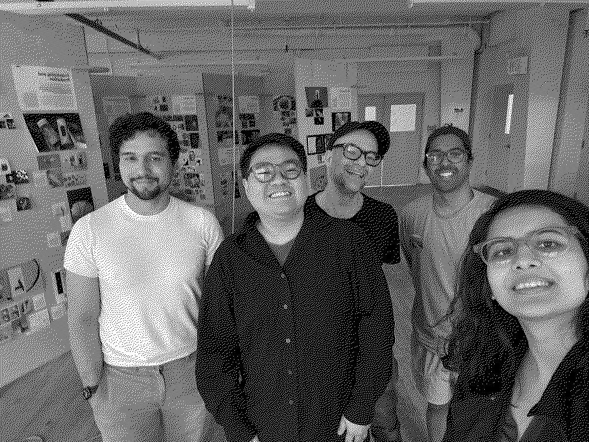
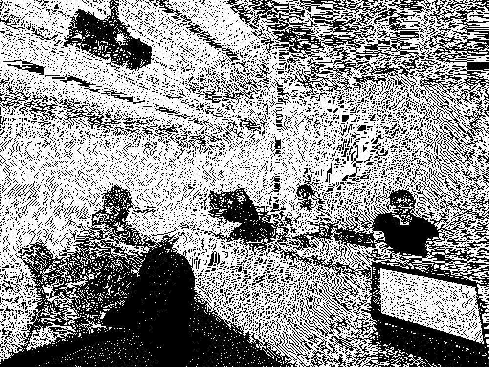

- Participants: Munus Shih, Aarushi Bapna, Avneesh Sarwate, Matt Martin, Arden Schager. May 9, Saturday, 2:00–4:30pm
- Originally outside on the lawn at Pratt. Rain plan: Steuben Hall, 4th floor, walking around and discussed in different places.



<audio controls preload="metadata" class="js-plyr">
  <source src="assets/pedagogy/why-your-brain-needs-friction-to-learn.mp3" type="audio/mpeg">
  <source src="assets/pedagogy/Why_your_brain_needs_friction_to_learn.m4a" type="audio/mp4">
  Your browser doesn't support inline audio. <a href="assets/pedagogy/why-your-brain-needs-friction-to-learn.mp3">Download the mp3</a>.
</audio>

I intentionally created an AI-generated podcast version of the writing here with [Google NotebookLM](https://notebooklm.google.com/)'s [Audio Overview](https://blog.google/technology/ai/notebooklm-audio-overviews/).

---

## How this works

There’s SO MUCH we can talk about! Pedagogy is not just about formal education but also how we learn in informal settings, how we teach ourselves, and how we share knowledge with each other.

I’d rather dive deep into a few things than skim everything, so I’ve prepared four talking points clustered around two big questions:

1. **How should we learn? How should we teach?**
2. **What should we learn? What should we teach?**

I want this to be a conversation, not a lecture. I’ll introduce each point briefly, and then we discuss it together. Instead of me yapping the whole time, I want to hear your thoughts, your experiences, your questions.

---

## How should we learn? How should we teach?

[In a big conference room]

### How did we learn in school?

My love and interest in becoming an educator in code did not stem from a wonderful experience learning code. It was the opposite. Like a lot of people, it’s more of a trauma-informed desire to reimagine how we can learn and teach.

When I was in engineering school, I had a terrible experience learning code. It was not only lecture-based: we were learning C, trying to memorize every detail of the language from cover to cover: types, operators, expressions, control flow, functions, arrays, pointers, structures, file I/O. (If you’re curious, this was our textbook: [Programming in C, 4th Edition](https://www.cs.sfu.ca/~ashriram/Courses/CS295/assets/books/C_Book_2nd.pdf).) It was also not mission-driven, not project-based. I was very surprised to read that Casey Reas, when writing the foreword for [Code as Creative Medium](https://mitpress.mit.edu/9780262542043/code-as-creative-medium/), shared a similar experience himself, where ultimately the final project for everyone was to build a fictional text-based bank account management system from scratch in the terminal.

For assessing how well we learn, there were two ways of testing it:

- One was a written test, where we had to write code on paper. Points off for syntax errors even when the logic was right. There was no way to test or debug it.
- The other was a practical test, on a computer with no internet, no documentation. Like solving a math problem. Limited time, retry as you can.

I believe this is still the dominant way of teaching code in schools. Many years later, I still feel like it was a perfect example of [learned helplessness](https://en.wikipedia.org/wiki/Learned_helplessness). I feel like it destroyed most people’s interest in coding, and that information was intentionally kept from us.

### Banking model of education

<figure>
  
  <figcaption><a href="https://envs.ucsc.edu/internships/internship-readings/freire-pedagogy-of-the-oppressed.pdf"><em>Pedagogy of the Oppressed</em></a> (Paulo Freire, 1968). Photo via <a href="https://commons.wikimedia.org/wiki/File:Paulo_Freire_1977.jpg">Wikimedia Commons</a>.</figcaption>
</figure>

Paulo Freire in [_Pedagogy of the Oppressed_](https://envs.ucsc.edu/internships/internship-readings/freire-pedagogy-of-the-oppressed.pdf) (1968) defined the “banking model” of education: a teacher deposits static facts into students, who store them and later get tested on whether they can retrieve them.

```text
Education thus becomes an act of depositing, in which the students are the depositories and the teacher is the depositor. Instead of communicating, the teacher issues communiqués and makes deposits which the students patiently receive, memorize, and repeat.

(Freire, Pedagogy of the Oppressed, Ch. 2)
```

Freire’s pedagogy was to dismantle this in favor of dialogic, liberatory education. The banking model reinforces a hierarchical relationship where the teacher is the authority and the student is the subordinate. Freire wanted a more participatory and collaborative approach, where students can freely question, challenge, and co-create knowledge with their teachers.

What does that look like in practice?

### Dialectical learning

I saw it firsthand in the philosophy and literature department.

Students were asked to read materials beforehand, and then we’d have guided discussions with the professor. The professor would ask questions, and we would discuss them together. Sometimes the professor played devil’s advocate and challenged our interpretations. Sometimes we’d debate each other. It was a very dynamic, interactive way of learning.

I don’t remember the content of the exact texts, but I remember that the experience shaped how I think about learning and knowledge: that there is value in the process of grappling with ideas and in the back-and-forth of dialogue. Value comes from understanding and engaging with the material.

This idea is older than the modern educational system. In [_Phaedrus_ (~370 BCE), at 274c–275b](https://www.gutenberg.org/files/1636/1636-h/1636-h.htm), Plato has Socrates tell the **myth of Theuth and Thamus**.

<div class="figure-row">
  <figure>
    
    <figcaption>Thoth (Theuth). Image via <a href="https://commons.wikimedia.org/wiki/File:Thoth.svg">Wikimedia Commons</a>.</figcaption>
  </figure>
  <figure>
    
    <figcaption>Socrates (~370 BCE). Bust at the Louvre, photo via <a href="https://commons.wikimedia.org/wiki/File:Socrates_Louvre.jpg">Wikimedia Commons</a>.</figcaption>
  </figure>
</div>

Theuth (an Egyptian god) presents King Thamus with a stack of inventions he has created. When he gets to **writing**, Theuth proudly claims it will make people wiser and improve their memory. King Thamus, however, disagrees:

```text
For this discovery of yours will create forgetfulness in the learners’ souls, because they will not use their memories; they will trust to the external written characters and not remember of themselves. The specific which you have discovered is an aid not to memory, but to reminiscence, and you give your disciples not truth, but only the semblance of truth; they will be hearers of many things and will have learned nothing; they will appear to be omniscient and will generally know nothing; they will be tiresome company, having the show of wisdom without the reality.

(Plato, Phaedrus 275a, Jowett trans.)
```

Socrates and Plato (the writer) are using this myth to critique learning by reading but not understanding. To them, reading someone’s writing (or a well-read person) only gives the appearance of wisdom: a book can’t answer questions or debate you like a teacher (Socrates) can. So if we want to learn, we need to engage in dialogue, not just read. We need to be able to ask questions, challenge ideas, and have a back-and-forth with the material.

> The funny twist: Plato makes this argument by writing it down and Socrates himself never wrote anything. The critique of writing comes to us through writing.

The optimistic reading of AI in education is that it restores the dialogue. Instead of a static book, we now have a conversational partner that can respond to our questions and scaffold our thinking. In a very techno-optimistic sense, an AI chatbot is closer to what Plato and Socrates would have wanted than a textbook is.

Or one could argue that AI tutors are the ultimate form of the banking model: they give you the answer, they don’t engage in dialogue, they don’t challenge you, they just deposit information into your head. So the question becomes: how should we change the way we engage students with material when we have AI tutors? What can a more dialogic, participatory, and critical pedagogy look like in the age of AI?

1. Sal Khan, [_Brave New Words: How AI Will Revolutionize (and Already Has) Education_](https://blogs.lse.ac.uk/impactofsocialsciences/2024/07/11/brave-new-words-how-ai-will-revolutionize-education-review/) (2024). The person who Khan Academy was very excited about suing AI as a Socratic tutor.
2. BERA, [_Generative Artificial Intelligence and a Return to Dialogue in Education_](https://www.bera.ac.uk/blog/generative-artificial-intelligence-and-a-return-to-dialogue-in-education) (2024). Connects Socrates’ concerns about writing to AI’s potential to restore dynamic question-and-answer exchanges.
3. [_We should talk more at school: Researchers call for more conversation-rich learning as AI spreads_](https://www.eurekalert.org/news-releases/1106127) (2025).

[We walked and then sat in a small classroom]

### Friction in learning

There’s a common misconception that a good and encouraging education should be **smooth and effortless**, and we see that being exemplified by AI tutors.

Auto-complete, code generation, debugging tools. The promise is that learning will get smoother, faster, more efficient. Instant feedback, personalized explanations. You could argue that students have never felt more supported and empowered, because they never feel stuck.

I’ve heard this firsthand from people at AI companies and educators. Some go further and say no one needs to learn how to code anymore. Here’s [John Maeda at SXSW 2026](https://youtu.be/dry_rIRsDl8?si=n97YNs4kr41OnIaP&t=2118) giving a talk about UX-to-AX, arguing that people no longer need to learn how to “code,” just how the machine thinks. (And of course self-plugging his book, [How to Speak Machine](https://www.howtospeakmachine.com/). The website is pretty ugly. I feel like it’s definitely made with AI.)

But what do cognitive and educational psychology say?

#### The Harvard physics study

In 2019, Louis Deslauriers and his team published a paper in _PNAS_ called _Measuring actual learning versus feeling of learning in response to being actively engaged in the classroom_ ([full text here](https://doi.org/10.1073/pnas.1821936116)). They built an experiment around a Harvard intro physics course.

In the class, they split students randomly. Half the students received active-learning sessions with peer instruction, group problem-solving, and an instructor walking around the room. The other half got a polished, well-rehearsed lecture on the same topic.

The next class, the groups swapped, on a different topic. Same instructors, same content, same students. The only thing that changed was the **format**. Right after each class, students took a 12-question test on the material and answered a survey on how much they felt they had learned.

The result, in the authors’ own words:

```text
This article addresses the long-standing question of why students and faculty remain resistant to active learning. Comparing passive lectures with active learning using a randomized experimental approach and identical course materials, we find that students in the active classroom learn more, but they feel like they learn less. We show that this negative correlation is caused in part by the increased cognitive effort required during active learning.

(Deslauriers, McCarty, Miller, Callaghan & Kestin, PNAS, 2019)
```

Deslauriers’ own framing in this [interview](https://news.harvard.edu/gazette/story/2019/09/study-shows-that-students-learn-more-when-taking-part-in-classrooms-that-employ-active-learning-strategies/):

```text
“Deep learning is hard work. The effort involved in active learning can be misinterpreted as a sign of poor learning,” he said. “On the other hand, a superstar lecturer can explain things in such a way as to make students feel like they are learning more than they actually are.”
(Deslauriers, 2019)
```

#### Desirable difficulties

**Robert A. Bjork** and Elizabeth Ligon Bjork, professors at the University of California, Los Angeles, coined the term _desirable difficulties_ back in 1994. From their accessible 2011 chapter [_Making things hard on yourself, but in a good way_](https://bjorklab.psych.ucla.edu/wp-content/uploads/sites/13/2016/04/EBjork_RBjork_2011.pdf):

```text
The basic problem learners confront is that we can easily be misled as to whether we are learning effectively and have or have not achieved a level of learning and comprehension that will support our subsequent access to information or skills we are trying to learn. We can be misled by our subjective impressions. Rereading a chapter a second time, for example, can provide a sense of familiarity or perceptual fluency that we interpret as understanding or comprehension, but may actually be a product of low-level perceptual priming. Similarly, information coming readily to mind can be interpreted as evidence of learning, but could instead be a product of cues that are present in the study situation, but that are unlikely to be present at a later time. We can also be misled by our current performance. Conditions of learning that make performance improve rapidly often fail to support long-term retention and transfer, whereas conditions that create challenges and slow the rate of apparent learning often optimize long-term retention and transfer.

(Bjork & Bjork, 2011)
```

They also outlined four types of desirable difficulties:

- **Varying the conditions of practice**: practicing in different contexts, with different materials, and under different conditions.
- **Spacing study or practice sessions**: spacing study out over time, rather than cramming.
- **Interleaving versus blocking instruction on separate to-be-learned tasks**: mixing different types of problems or materials during study or practice, rather than focusing on one type at a time.
- **Generation effects and using tests (rather than presentations) as learning events**: generating an answer, solution, or procedure yourself, rather than being presented with one.

There’s a compelling wrestling match with friction in pedagogy here. Notice how the dominant AI tutoring narrative is engineered to **remove** these frictions. Auto-complete fills in the answer before you’ve struggled with it. Personalized explanations smooth over the wrestle. Instant feedback collapses the gap that retrieval practice depends on. The whole UX of the AI tutor is built on the same assumption the Deslauriers students had: that smoothness equals learning.

That said, if the friction is too high, it can easily tip into frustration and learned helplessness. In the Harvard study, the authors concluded that it’s the instructor’s job to explain to students that the struggle is a sign of learning, not a sign of failure.

```text
It can be tempting to engage the class simply by folding lectures into a compelling ‘story,’ especially when that’s what students seem to like. I show my students the data from this study on the first day of class to help them appreciate the importance of their own involvement in active learning.

(Greg Kestin, preceptor in physics, 2019)
```

This ties back to one of my favorite theories of learning: [TILT (Transparency in Learning and Teaching)](https://tilthighered.com/) by Mary-Ann Winkelmes. In [this article](https://csuepress.columbusstate.edu/cgi/viewcontent.cgi?article=1213&context=pil), she writes:

```text
Transparency in Learning and Teaching (TILT) is an educational framework for engaging teachers and students in communicating together about how students are learning, how they can apply their learning in real-world situations in their lives after college, and why instructors manipulate the students’ learning experiences in the specific ways they choose.

The simple, tripartite TILT Framework (purpose, tasks, criteria) serves to frame those conversations among teachers and students, to help teachers make evidence-based choices about instructional strategies, and to support students’ critical thinking about their learning before they begin a learning activity or project (Winkelmes, 2013).
```

### Can AI give us the critical pedagogy bell hooks asked for?

<figure>
  
  <figcaption>bell hooks, 1994. Photo via <a href="https://commons.wikimedia.org/wiki/File:Bell_hooks,_October_2014.jpg">Wikimedia Commons</a>.</figcaption>
</figure>

In [_Teaching to Transgress: Education as the Practice of Freedom_](https://sites.utexas.edu/lsjcs/files/2018/02/Teaching-to-Transgress_-Education-as-the-Practice-of-Freedom-bell-hooks.pdf) (1994), bell hooks argues that education should be a practice of freedom, not domination. She advocates for a pedagogy that is inclusive, participatory, and transformative, and emphasizes the importance of dialogue, critical thinking, and the recognition of students’ lived experiences:

```text
To educate as the practice of freedom is a way of teaching that anyone can learn. That learning process comes easiest to those of us who teach who also believe that there is an aspect of our vocation that is sacred; who believe that our work is not merely to share information but to share in the intellectual and spiritual growth of our students. To teach in a manner that respects and cares for the souls of our students is essential if we are to provide the necessary conditions where learning can most deeply and intimately begin.
(bell hooks, Teaching to Transgress, 1994)
```

The dominant ed-tech pitch is that AI gives students “freedom to learn.” That usually means limitless personalization, infinite patience, no gatekeepers, learn at your own pace.

However, some researchers have argued that what AI actually delivers is none of those things. Three counter-readings worth taking seriously:

**Illusion of freedom.** Individualized “freedom” is the same kind of freedom Uber drivers have: the freedom to be alone with a platform owned by someone else.

The framing comes out of Audre Lorde’s [_The Master’s Tools Will Never Dismantle the Master’s House_](https://monoskop.org/images/2/2b/Lorde_Audre_1983_The_Masters_Tools_Will_Never_Dismantle_the_Masters_House.pdf) (1984), and Shoshana Zuboff’s [_The Age of Surveillance Capitalism_](https://raggeduniversity.co.uk/wp-content/uploads/2024/08/1_x_Shoshana-Zuboff-The-Age-of-Surveillance-Capitalism_-The-Fight-for-a-Human-Future-at-the-New-Frontier-of-Power-PublicAffairs-Books-2019.pdf) (2019), which argues that hyper-personalized digital “experiences” are the front-end of a behavior-modification market.

Audrey Watters’ [_Teaching Machines: The History of Personalized Learning_](https://mitpress.mit.edu/9780262045698/teaching-machines/) (2021) traces this exact pitch (“freedom to learn at your own pace”) back to Skinner-era ed-tech and shows it has always been a marketing line.

**Monoculturing.** Models are trained on hegemonic, English-dominant, uncontextualized materials. Treating them as neutral oracles flattens marginalized epistemologies under a statistical average.

Safiya Umoja Noble, [_Algorithms of Oppression: How Search Engines Reinforce Racism_](https://nyupress.org/9781479837243/algorithms-of-oppression/) (2018), and Emily M. Bender, Timnit Gebru, Angelina McMillan-Major, and Margaret Mitchell, [“On the Dangers of Stochastic Parrots: Can Language Models Be Too Big?”](https://dl.acm.org/doi/10.1145/3442188.3445922) (FAccT 2021) both argue that Education was never neutral; it’s political and culturally situated. AI tutors trained on the internet are a centralizing force disguised as a democratizing one.

**Loss of ownability.** Who owns the model and the knowledge it produces? On April 29, 2026, at a [marathon Panel for Educational Policy meeting](https://www.chalkbeat.org/newyork/2026/05/01/parents-demand-ai-moratorium-in-schools-during-marathon-panel-for-educational-policy-meeting/), over 100 New Yorkers testified for nearly seven hours, demanding a two-year freeze on AI use in NYC public schools and citing data privacy, lack of transparency, and zero vetting of the AI tools their kids are being assigned. One parent said:

```text
I’ve never been an activist before, but I feel so strongly about this: It is starting. Gen Z is turning against AI; I’m turning against AI. The city is telling us that AI is inevitable, but won’t tell me what devices and applications my children are using. You tell us you are spending our money to give artificial intelligence to our children?

(Parent testimony, NYC Panel for Educational Policy, April 29, 2026)
```

---

[We walked and then sat in a sunny studio space]

## What should we learn? What should we teach?

In UNESCO’s [_AI Competency Framework for Students_](https://unesdoc.unesco.org/ark:/48223/pf0000391105) (August 2024), AI literacy is organized around **four competency blocks**, each at three progression levels: **Understand → Apply → Create**.

The four blocks are:

1. **Human-centred mindset.** Moving from human agency, to human accountability, to citizenship in the era of AI.
2. **Ethics of AI.** Moving from ethical principles, to safe and responsible use, to co-creating ethical AI.
3. **AI techniques and applications.** Moving from foundational AI knowledge, to application skills, to creating AI tools.
4. **AI system design.** Moving from problem scoping, to architecture design, to iteration and feedback loops.

The report is super interesting. I highly recommend reading it. It’s broad and ambitious, and it tells institutions what new content students should learn _about_ AI.

The “Apply” level is where most of the AI-in-education conversation is happening right now: students using AI as a tool to help them learn, get unstuck, be more efficient. But for creative or design education, the “Create” level is where we ultimately want to be, where students are building their own models, agents, and tools.

### Thought experiments, data collection, and prompting

I’m teaching a class next semester that aims to provide students with the AI literacy outlined in the UNESCO framework. Here’s how I’m planning to approach it.

#### Understand: metaphor, paradox, thought experiments

Before students _use_ AI, I want them to question: What is artificial intelligence? How are we defining intelligence from an epistemological perspective? I actually majored in AI and Deep Learning back in undergrad, but some of the most interesting discussions I had were the thought experiments that challenged our assumptions about what intelligence is, in the philosophy class; or the early coding projects that tried to simulate intelligence, in the creative coding class.

Some examples I want students to argue about:

[**The Chinese Room**](https://web.archive.org/web/20071210043312/http://members.aol.com/NeoNoetics/MindsBrainsPrograms.html) (Searle, 1980, _Minds, Brains, and Programs_, _Behavioral and Brain Sciences_). Can a system that manipulates symbols according to rules be said to “understand” anything?

[**The Turing Test**](https://academic.oup.com/mind/article/LIX/236/433/986238) (Turing, 1950, _Computing Machinery and Intelligence_, _Mind_). Originally called “the imitation game.” How do we tell intelligence from a sufficiently good imitation of it?

<div class="figure-row">
  <figure>
    
    <figcaption>The “Useless Machine,” design by Marvin Minsky, built by Claude Shannon at Bell Labs (~1952). Photo via <a href="https://commons.wikimedia.org/wiki/File:UselessMachine.png">Wikimedia Commons</a>.</figcaption>
  </figure>
</div>

**The Useless Machine.** Marvin Minsky’s design, built by Claude Shannon at Bell Labs around 1952. Arthur C. Clarke after seeing it on Shannon’s desk:

```text
There is something unspeakably sinister about a machine that does nothing, absolutely nothing, except switch itself off.
(Arthur C. Clarke)
```

**Early intelligence examples.** [ELIZA](https://www.masswerk.at/elizabot/) (Weizenbaum, 1966) as the original chatbot, designed to expose how easily we project understanding onto pattern-matching.

<figure>
  
  <figcaption><a href="https://dl.acm.org/doi/10.1145/365153.365168"><em>ELIZA: A Computer Program For the Study of Natural Language Communication</em></a> (Joseph Weizenbaum, 1966). Screenshot of the DOCTOR script via <a href="https://commons.wikimedia.org/wiki/File:ELIZA_conversation.png">Wikimedia Commons</a>.</figcaption>
</figure>

**Conway’s Game of Life** (1970, popularized in Martin Gardner’s _Scientific American_ column) as the simplest demonstration of complex behavior from simple rules.

<figure>
  
  <figcaption>Gosper’s glider gun, from <a href="https://web.stanford.edu/class/sts145/Library/life.pdf"><em>Mathematical Games: The fantastic combinations of John Conway’s new solitaire game “Life”</em></a> (Martin Gardner, <em>Scientific American</em>, October 1970). Animation via <a href="https://commons.wikimedia.org/wiki/File:Gospers_glider_gun.gif">Wikimedia Commons</a>.</figcaption>
</figure>

**Markov chains** (Andrey Markov, early 1900s; used by Shannon in his foundational 1948 paper [_A Mathematical Theory of Communication_](https://people.math.harvard.edu/~ctm/home/text/others/shannon/entropy/entropy.pdf) to model English text) as the pre-history of language models.

#### Apply: data collection

How do we collect data for training models? What are the ethical implications of collection? How does a machine cluster, synthesize, and flatten data? What are the power dynamics involved when we decide what counts as data and what doesn’t?

#### Create: designing models by prompting

With LLMs, the only way to test the model is through prompting. What are the different types of prompting? How can we get the most out of the model? What are the limitations of prompting? How does prompting shape our thinking and our relationship with the model?

The most advanced AI researchers are also prompting with AI. As users on the other end, we are producing as much knowledge as the researchers by prompting the model and finding quirks and hidden patterns in its behavior.

---

## Closing: Embodied learning

I think there’s a huge opportunity missing in the current pedagogy of AI. If AI is so good at processing and generating text, then maybe we should focus on learning through other modalities. Through doing, through making, through experiencing. Through our bodies, through our senses, through our emotions.

Can we memorize not just through text, but through movement, experience, game, play, art, music? Can we learn through our bodies and our senses, not just through our minds?

There’s a cognitive-science framework I want to name for this called **4E Cognition**: Embodied, Embedded, Enactive, Extended. The foundational text is [_The Embodied Mind: Cognitive Science and Human Experience_](https://mitpress.mit.edu/9780262529365/the-embodied-mind/) (Varela, Thompson & Rosch, 1991).

```text
By using the term embodied we mean to highlight two points: first, that cognition depends upon the kinds of experience that come from having a body with various sensorimotor capacities, and second, that these individual sensorimotor capacities are themselves embedded in a more encompassing biological, psychological, and cultural context.

(Varela, Thompson & Rosch, The Embodied Mind, 1991, Ch. 8)
```

It argues that cognition isn’t a _brain-in-a-vat_ processing symbols, but a full body in an environment, with tools, in relation to other bodies. If AI handles the disembodied text-and-symbol work, education has to over-index on what AI structurally can’t do: the physical, the sensory, the spatial, the place-based, the social.

> Interestingly, **Brain in a vat** is a phrase from a famous philosophical thought experiment and often used to challenge Artificial Intelligence now.



This is also why we’re sitting here inperson with printed papers and trying to walk around and write things, instead of doing this online with a shared Google Doc. I want our body to register the ideas we’re talking about, and to access different parts of our brain and memory than we would if we were just reading or typing.

I’ve designed a few games in class for students to learn through play. One is a game where students have to act as dialing telephone numbers, as a router, as a DNS server, in order to understand how the internet works.

My argument is this: you can have AI explain to you what a DNS is in 30 seconds and immediately forget; you can read about how DNS works for an hour and not get it; or you can pretend to _be_ a DNS server for ten minutes and never forget.
